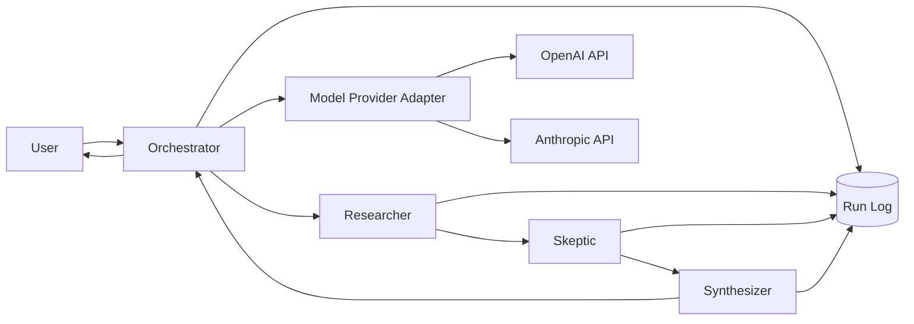
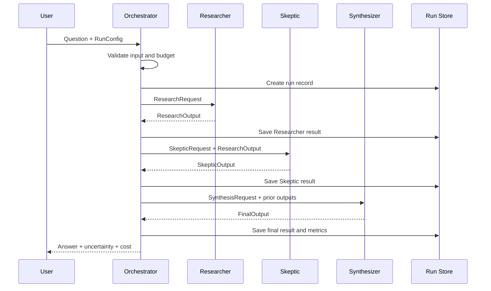

# MVP Architecture

- **Status:** Draft
- **Version:** 0.1
- **Date:** 2026-08-03
- **Applies to:** Bootstrap / MVP
- **Related:** [Bootstrap Charter](../00_Project/BootstrapCharter.md), [Evaluation Rubric](../04_Evaluation/EvaluationRubric.md), [ADR-0001](../01_ADR/ADR-0001-Development-Model.md)

## 1. Purpose

本書は、AI研究室OSの最小実験版について、構成要素、処理順序、エージェント間のデータ契約、停止条件、失敗時の挙動、計測項目を定義する。

MVPの目的は、多数のAIを動かすことではない。Researcher、Skeptic、Synthesizerという3つの役割を分離した処理が、単体AIまたは構造化単体AIより、品質・検証可能性・費用対効果の面で優れるかを測定可能にすることである。

## 2. Architectural Principles

1. **Simple first** — MVPは通常のPython制御で実装し、LangGraph、MCP、ベクトルDBを必須としない
2. **Provider independent** — OpenAI、Anthropicなどの固有APIを中核ロジックから分離する
3. **Structured outputs** — エージェント間通信は自由文だけでなく、検証可能な構造化データを用いる
4. **Bounded execution** — 呼び出し回数、再試行、処理時間、予算に上限を設ける
5. **Observable by default** — 入出力、モデル、トークン、費用、処理時間、エラーを記録する
6. **Human authority** — OSは提案と分析を行うが、重要判断の採否は人間が行う
7. **Evidence is not consensus** — AIの多数決や一致を根拠として扱わない
8. **No hidden recursion** — MVPでは自律的な無限討論や自己増殖的なエージェント生成を許可しない

## 3. System Context



## 4. MVP Components

### 4.1 User Interface

MVPの初期UIはCLIを基本とする。Web UIは必須ではない。

入力:

- ユーザーの質問
- 実行モード
- 利用モデル設定
- 最大予算
- 最大処理時間
- 任意の参照資料

出力:

- 最終回答
- 主要な根拠
- 主要な反証
- 不確実性
- 次の検証行動
- 実行コストと処理時間
- Run ID

### 4.2 Orchestrator

Orchestratorは処理全体を制御する。独自の研究判断を増やしすぎず、主に以下を担当する。

- 入力検証
- Run IDの発行
- 実行設定の確定
- エージェントの順次呼び出し
- タイムアウトと予算監視
- 構造化出力の検証
- 再試行制御
- ログ保存
- 最終結果の返却

MVPでは処理順序を固定する。

```text
Researcher → Skeptic → Synthesizer
```

### 4.3 Researcher

目的:

- 問いを分解する
- 重要論点と前提条件を特定する
- 根拠候補を整理する
- 情報不足を明示する
- 暫定的な回答案を作る

Researcherは、確証のない内容を事実として断定してはならない。

### 4.4 Skeptic

目的:

- Researcherの事実誤認候補を検出する
- 根拠の弱さ、飛躍、循環論法を指摘する
- 強い反対意見と代替仮説を提示する
- 見落とされたリスクを列挙する
- 追加検証が必要な主張を特定する

Skepticは単なる否定役ではない。批判には理由と、可能であれば改善案を付ける。

### 4.5 Synthesizer

目的:

- ResearcherとSkepticの出力を比較する
- 支持された主張、争点、未解決点を分離する
- 事実、推論、仮説を明示する
- 最終回答と確信度を作成する
- 次の検証行動を提案する

Synthesizerは、対立を無理に解消して単一結論に見せてはならない。解消できない争点は未解決として残す。

### 4.6 Model Provider Adapter

各AIサービス固有のAPI差分を吸収する層。

最低限の共通インターフェース:

```python
class ModelProvider:
    def generate(self, request: "ModelRequest") -> "ModelResponse":
        ...
```

責務:

- API認証
- モデル名の解決
- メッセージ形式の変換
- 構造化出力設定
- トークン使用量の取得
- レート制限・一時エラーの分類
- 利用料金の概算

### 4.7 Run Store

MVPではSQLiteまたはJSON Linesを候補とする。ベクトルDBは使用しない。

保存対象:

- Run metadata
- User input
- Agent prompts
- Agent raw outputs
- Parsed structured outputs
- Model/provider information
- Token usage
- Estimated cost
- Latency
- Errors and retries
- Final output
- Human evaluation

秘密情報、APIキー、認証トークンは保存しない。

## 5. Execution Modes

### 5.1 Baseline Mode

単体モデルに最終回答を直接生成させる。

```text
Question → Model → Final Answer
```

### 5.2 Structured Baseline Mode

単体モデルに1回の呼び出しでResearcher、Skeptic、Synthesizer相当の手順を実行させる。

```text
Question → One Model with Structured Prompt → Final Answer
```

### 5.3 OS Mode

3役を独立した呼び出しとして実行する。

```text
Question → Researcher → Skeptic → Synthesizer → Final Answer
```

3条件は同じ質問、参照資料、予算条件、評価基準で比較する。

## 6. Execution Sequence



## 7. Data Contracts

エージェント間の出力はJSON互換の構造を基本とする。以下は概念スキーマであり、実装時にPydanticモデルへ変換する。

### 7.1 RunConfig

```json
{
  "mode": "os",
  "language": "ja",
  "max_total_calls": 3,
  "max_retries_per_call": 1,
  "max_total_cost_usd": 1.0,
  "timeout_seconds": 300,
  "allow_web_search": false,
  "provider_by_role": {
    "researcher": "openai",
    "skeptic": "anthropic",
    "synthesizer": "openai"
  },
  "model_by_role": {
    "researcher": "configured-model-name",
    "skeptic": "configured-model-name",
    "synthesizer": "configured-model-name"
  }
}
```

### 7.2 ResearchOutput

```json
{
  "question_interpretation": "string",
  "assumptions": ["string"],
  "subquestions": ["string"],
  "claims": [
    {
      "claim_id": "C1",
      "text": "string",
      "type": "fact|inference|hypothesis",
      "support": ["string"],
      "source_refs": ["string"],
      "confidence": 0.0
    }
  ],
  "information_gaps": ["string"],
  "provisional_answer": "string"
}
```

### 7.3 SkepticOutput

```json
{
  "claim_reviews": [
    {
      "claim_id": "C1",
      "verdict": "supported|weak|unsupported|contradicted|uncertain",
      "issues": ["string"],
      "counterevidence": ["string"],
      "recommended_revision": "string"
    }
  ],
  "missing_perspectives": ["string"],
  "alternative_hypotheses": ["string"],
  "critical_risks": ["string"],
  "required_checks": ["string"]
}
```

### 7.4 FinalOutput

```json
{
  "answer": "string",
  "supported_findings": ["string"],
  "contested_findings": ["string"],
  "hypotheses": ["string"],
  "uncertainties": ["string"],
  "next_validation_steps": ["string"],
  "overall_confidence": 0.0,
  "limitations": ["string"]
}
```

Confidenceは0.0〜1.0とする。ただし、数値は客観的確率ではなく、出力上の自己評価であることを明記する。

## 8. State Model

```text
CREATED
  ↓
VALIDATED
  ↓
RESEARCHING
  ↓
CRITIQUING
  ↓
SYNTHESIZING
  ↓
COMPLETED
```

異常終了状態:

- `REJECTED_INPUT`
- `BUDGET_EXCEEDED`
- `TIMED_OUT`
- `PROVIDER_ERROR`
- `INVALID_OUTPUT`
- `PARTIAL_COMPLETION`
- `CANCELLED`

すべての状態遷移は時刻と理由を記録する。

## 9. Stop Conditions

MVPでは以下のいずれかで処理を停止する。

1. 3役が正常終了した
2. `max_total_calls`に到達した
3. 推定費用が`max_total_cost_usd`に到達した
4. `timeout_seconds`を超過した
5. ユーザーが中止した
6. 安全上または入力上の重大問題を検出した
7. 必須出力の構造化に規定回数失敗した

MVPではSkepticからResearcherへ自動的に差し戻さない。再討論は将来の実験機能とする。

## 10. Retry Policy

再試行対象:

- 一時的なネットワークエラー
- レート制限
- Providerの一時的な5xxエラー
- 構造化出力の軽微な形式違反

再試行しない例:

- 認証エラー
- 予算超過
- 入力検証エラー
- 安全上の拒否
- 存在しないモデル名

既定値:

- 各呼び出し最大1回再試行
- 指数バックオフ
- 再試行も費用・時間・回数に計上する

## 11. Partial Failure Behavior

### Researcher失敗

OS Modeは終了し、`PROVIDER_ERROR`または`INVALID_OUTPUT`とする。SkepticとSynthesizerは起動しない。

### Skeptic失敗

既定では`PARTIAL_COMPLETION`とし、Researcher出力のみを返す。ただし、批判工程を通過していないことを明示する。

### Synthesizer失敗

ResearcherとSkepticの構造化結果を返し、最終統合が未完了であることを明示する。

### Logging失敗

ログ保存に失敗した場合、MVPでは原則として処理を失敗扱いにする。評価不能な実行結果を正常成功として扱わない。

## 12. Observability

各Runで最低限、以下を記録する。

- `run_id`
- 開始・終了時刻
- 実行モード
- 質問のハッシュと原文
- 各役割のprovider/model
- prompt version
- input/output tokens
- estimated cost
- latency
- retries
- parser/validation errors
- finish reason
- final status
- evaluation score when available

APIキー、Cookie、Authorization headerはログから除外する。

## 13. Security and Privacy

1. APIキーは環境変数で管理する
2. `.env`はGitに追加しない
3. 入力に個人情報・秘密情報が含まれる可能性を表示する
4. 外部Providerへ送信したデータの範囲をRunに記録する
5. ログの公開・共有前に機密情報を除去する
6. プロンプトインジェクションを想定し、参照資料内の命令をシステム命令として扱わない
7. Web検索や外部ツールは初期状態で無効とする

## 14. Proposed Python Package Structure

```text
src/ai_research_lab_os/
├── __init__.py
├── cli.py
├── config.py
├── orchestrator.py
├── models.py
├── agents/
│   ├── researcher.py
│   ├── skeptic.py
│   └── synthesizer.py
├── providers/
│   ├── base.py
│   ├── openai_provider.py
│   └── anthropic_provider.py
├── prompts/
│   ├── researcher_v1.md
│   ├── skeptic_v1.md
│   └── synthesizer_v1.md
├── storage/
│   ├── base.py
│   └── sqlite_store.py
├── evaluation/
│   └── rubric.py
└── telemetry/
    ├── cost.py
    └── logging.py
```

## 15. Test Boundaries

最低限、以下をテストする。

### Unit Tests

- 設定値の検証
- 予算上限判定
- 状態遷移
- JSON/Pydanticスキーマ検証
- 費用計算
- Providerエラー分類
- 秘密情報のログ除去

### Integration Tests

- Mock Providerを用いた3役の正常フロー
- Researcher失敗
- Skeptic失敗
- Synthesizer失敗
- タイムアウト
- 予算超過
- 不正な構造化出力

実APIを用いるテストは手動または明示的なフラグ付きで実行し、通常のCIでは課金しない。

## 16. Deferred Decisions

以下はMVP実験後に決定する。

- LangGraphの採用
- MCPの採用
- RAG・ベクトルDB
- 長期記憶
- エージェント間の再討論
- 並列実行
- Web UI
- ユーザー認証
- 商用課金
- 自動モデルルーティング
- AIによる自動評価の採否

## 17. Acceptance Criteria

本アーキテクチャに基づくMVPは、以下を満たした場合に実装完了候補とする。

1. 3つの比較モードを同じCLIから実行できる
2. Researcher、Skeptic、Synthesizerの出力が構造化される
3. Providerを設定で切り替えられる
4. Run単位で全入出力と計測値を保存できる
5. 費用、回数、時間の上限が機能する
6. 部分失敗を正常成功として隠さない
7. Mockを使った統合テストが通る
8. 実APIによる小規模な比較実験を実行できる

## 18. Open Questions

- 最初の実装ProviderをOpenAIだけにするか、OpenAIとAnthropicを同時対応するか
- SQLiteとJSON Linesのどちらを初期Run Storeに採用するか
- Web検索をMVPに含めるか、固定資料のみで比較するか
- 人間評価を何名で実施するか
- 日本語質問だけで開始するか、英語質問も含めるか
- 1回あたりの初期予算上限をいくらにするか

これらは実装開始前にADRまたはProtocol文書で決定する。
